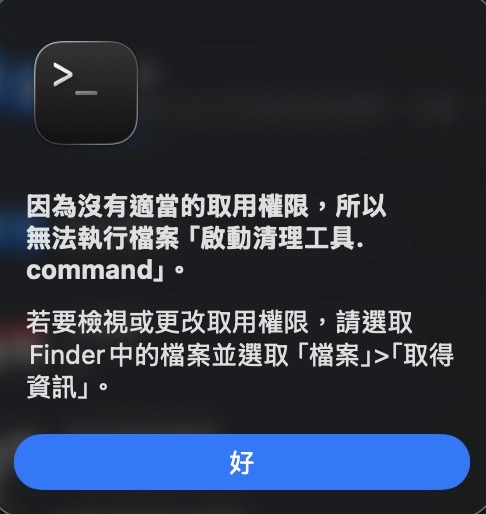
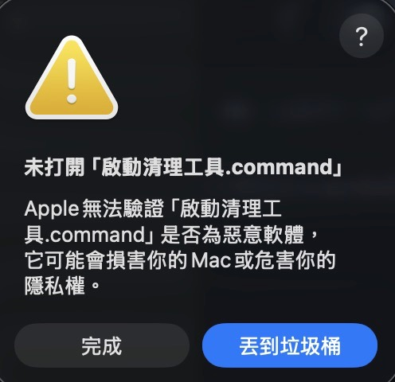
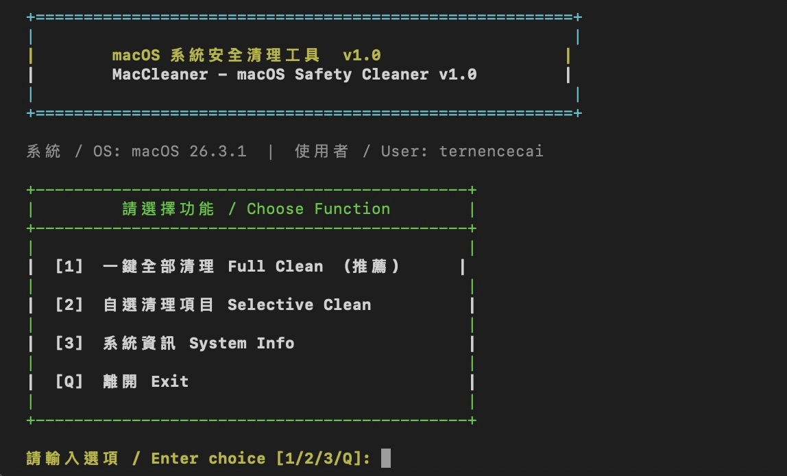

# MacCleaner v1.1 - macOS 系統安全清理工具
# MacCleaner v1.1 - macOS Safe System Cleaner

一款安全、有感、小白也能上手的 macOS 系統清理工具。
清理完會告訴你釋放了多少空間，讓你真的感受到差異。

A safe, effective, beginner-friendly macOS system cleaner.
It shows exactly how much space was freed after each clean.

> **安全第一 / Safety First** — 絕對不碰個人檔案、對話紀錄、帳號設定。只清快取垃圾。
> Never touches personal files, chat history, or account settings. Only cache and junk files.

---

## 下載使用 / How to Use

### 步驟一：下載 / Step 1: Download

點右上角綠色 **Code** → **Download ZIP** → 解壓縮

Click the green **Code** button → **Download ZIP** → Unzip

---

### 步驟二：第一次執行（授予執行權限）/ Step 2: First Run (Grant Permission)

從 GitHub 下載的檔案預設沒有執行權限，需要手動授予一次。
Files downloaded from GitHub don't have execute permission by default. You need to grant it once.

**方法 / How to:**

1. 開啟「終端機」(Terminal)
2. 輸入 `chmod +x ` （注意後面有一個空格）
3. 將 `啟動清理工具.command` **拖入**終端機視窗
4. 按 **Enter**

```
chmod +x /path/to/啟動清理工具.command
```

> 如果看到下圖錯誤，就是需要執行上述步驟 👇
> If you see the error below, you need to run the command above 👇



---

### 步驟三：macOS 安全性提示 / Step 3: macOS Security Warning

第一次雙擊執行時，macOS 可能會顯示下圖警告：
The first time you run it, macOS may show this warning:



**解決方式 / How to fix:**

1. 點「**完成**」關閉警告（不要點「丟到垃圾桶」！）
2. 開啟「**系統設定**」→「**隱私權與安全性**」
3. 往下滑，找到「已封鎖『啟動清理工具.command』的使用」
4. 點「**仍要打開**」→ 輸入 Mac 密碼確認

> 這是 macOS 對未上架 App Store 的程式的正常保護機制，不代表程式有問題。
> This is macOS's standard protection for apps not from the App Store. The tool is safe.

---

### 步驟四：開始清理 / Step 4: Start Cleaning

雙擊 `啟動清理工具.command`，會看到以下畫面：
Double-click `啟動清理工具.command` and you'll see:



- 輸入 `1` → **一鍵全部清理**（推薦）
- 輸入 `2` → 自選清理項目
- 輸入 `3` → 查看系統資訊
- 輸入 `Q` → 離開

---

## 清理項目 / What Gets Cleaned

| 項目 | 說明 | 自動/詢問 |
|------|------|---------|
| 使用者快取 User Caches | `~/Library/Caches` | 自動 |
| 使用者日誌 User Logs | `~/Library/Logs` | 自動 |
| 資源回收筒 Trash | 清空垃圾桶 | **詢問** |
| 瀏覽器快取 Browser Cache | Chrome / Safari / Firefox / Edge | 自動 |
| App 快取 App Cache | Discord / Slack / Zoom / Teams / Spotify / Homebrew | 自動 |
| npm 快取 npm Cache | `~/.npm` | 自動 |
| pip 快取 pip Cache | Python 套件快取 | 自動 |
| Yarn 快取 Yarn Cache | `~/.yarn/cache` | 自動 |
| QuickLook 縮圖 | 系統預覽圖快取 | 自動 |
| `.DS_Store` 隱藏檔 | macOS 資料夾設定檔 | 自動 |
| `._*` 隱藏檔 | macOS resource fork | 自動 |
| 下載暫存檔 Downloads Temp | `.tmp` / `.part` / `.crdownload` | 自動 |
| Mail 附件下載 | `~/Library/Mail Downloads` | 自動 |
| Xcode DerivedData | Xcode 編譯快取（開發者） | **詢問** |
| iOS Device Support | 舊版 iOS 符號檔（開發者） | **詢問** |
| Simulator 快取 | CoreSimulator 快取（開發者） | **詢問** |
| iOS 裝置備份 iOS Backups | Mac 本機 iPhone 備份 | **二次確認** |
| Docker | 未使用的 image / 容器 | **詢問** |

> **偵測到才詢問**：Xcode、iOS Device Support、Simulator、iOS 備份、Docker，系統沒有這些東西就不會出現提示。
> Items marked "詢問" only appear if detected on your system.

---

## 安全說明 / Safety

- **不需要管理員密碼** — 全部在使用者目錄操作
  **No admin password required** — operates entirely within your user directory
- 不會刪除個人檔案（文件、圖片、影片、音樂）
  Never deletes personal files (documents, photos, videos, music)
- 不會刪除 LINE 對話、Discord 設定、瀏覽器書籤與密碼
  Never deletes LINE chats, Discord settings, browser bookmarks or passwords
- 不會碰系統核心目錄（SIP 保護區）
  Never touches system directories (protected by SIP)
- 危險操作（iOS 備份、Xcode 快取）需手動確認才執行
  Risky operations require manual confirmation before proceeding
- iOS 備份需**二次確認**（輸入 YES）才會刪除
  iOS backups require typing YES to confirm deletion

---

## 支援系統 / Requirements

- macOS 10.12 Sierra ～ macOS 15 Sequoia（所有版本）
- 不需要安裝任何額外軟體 / No additional software required

---

## 更新日誌 / Changelog

### v1.1（2026-03-29）
- 新增：npm / pip / Yarn 快取清理
- 新增：QuickLook 縮圖快取
- 新增：macOS `._*` 隱藏檔清理
- 新增：iOS 裝置備份（二次確認保護）
- 新增：Docker 未使用資源清理
- 新增：iOS Device Support / Simulator 快取
- 新增：Mail 附件下載清理
- 共支援 18 項清理功能

### v1.0（2026-03-20）
- 初始發布
- 支援 8 項清理功能
- 雙語介面（中/英）
- 無需管理員密碼
